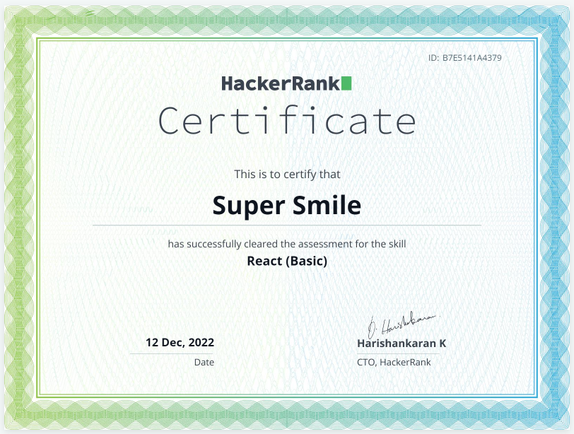
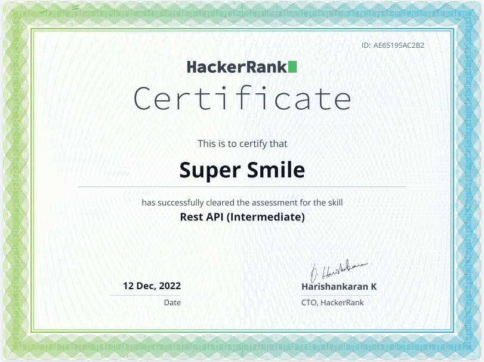
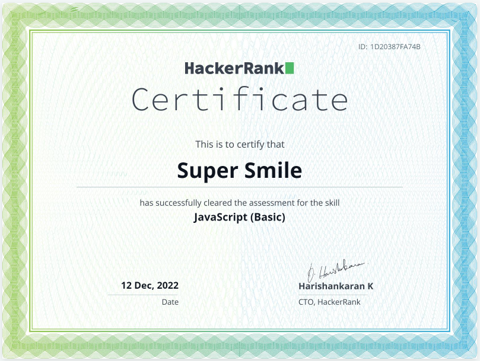
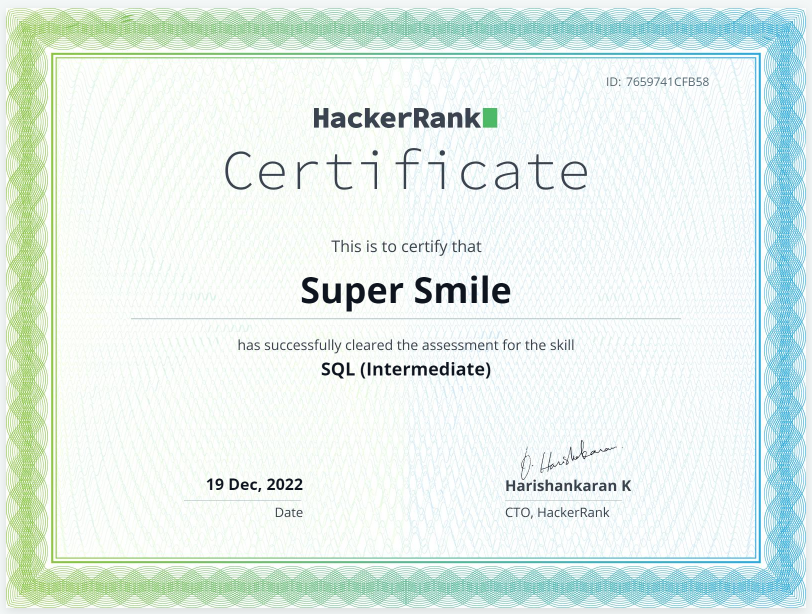
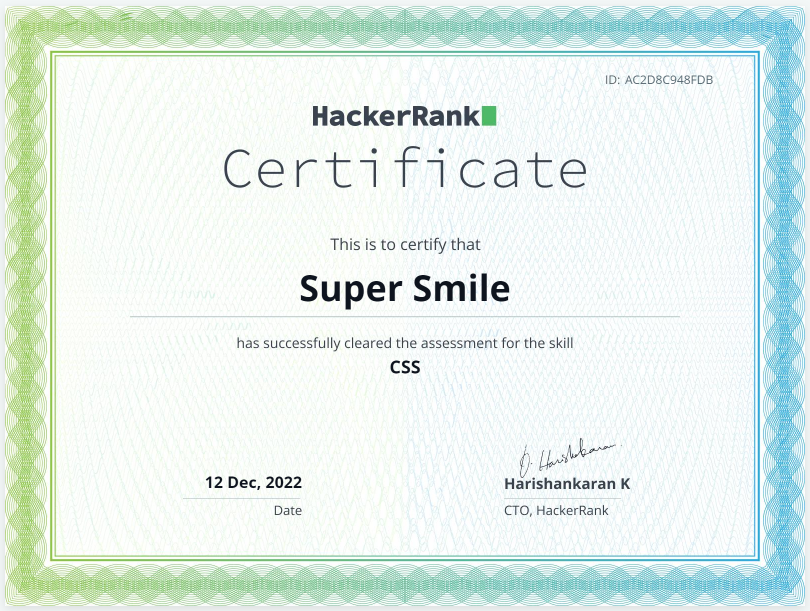

<meta name="awesome-portfolio"/>
<meta title="awesome-portfolio"/>
<meta description="awesome-portfolio"/>

<meta name="portfolio"/>
<meta name="github"/>
<meta name="full-stack"/>

  

# Senior Software Engineer

Experienced Full-Stack Engineer with proficiency in developing high-quality software solutions and collaborating with cross-functional teams. Skilled in JavaScript, HTML, CSS, TypeScript, Go, Python, SQL, Dart, GraphQL, Sass, PHP, Solidity, WASM, Python 3, HTML5, CSS3 and Java; with a passion for continuous learning and staying up-to-date with emerging technologies.

## Work History :

- Senior Software Engineer (Nutech Advisors, 2022-2023)
  -	Developed code according to common security practices and development patterns
  -	Resolved technical issues for US customers using specific tools and APIs such as Nexio API, IDX Broker, GoHighLevel
  - Created 200+ unit tests to verify user interface functionality, back-end processing, connectivity, and interactions with relational databases
  - Maintained the CI/CD and Published React, React Native and Cocos SDKs
  - Collaborated with mobile dev team on the agile/scrum board (Linear, Github)
    
- Frontend & Blockchain Developer (ClamIsland, 2021 - 2022)
  - Managed the front-end development as a lead front-end developer
  -	Implemented React, Typescript code to achieve maximum impact when creating event websites and landing pages
  -	Designed and developed custom swap forking PancakeSwap
  -	Implemented needed analysis, estimated timelines, and prepared project proposals

- Senior Frontend Developer (Rentberry, 2022 - 2022)
  - Translate the design of UX /UI into high quality web and mobile components such as dropdowns, carousels, buttons, checkboxes, input icons and so on
  -	Managed a high level of expertise in react-state management strategies, including redux, redux persist, and redux-saga
  -	Implemented following TDD using the Jest framework with Enzyme testing utilities
  -	Effective use of native HTML elements and custom tags to improve SEO optimization and application compliance ADA
  -	Participated in the initial wave of developers learning and implementing the React library.

- Junior Frontend Developer (Upmarket Pets, )
  -	Created modular, responsive templates using modern CSS and JavaScript libraries.
  - Maintained graphic standards and branding throughout the product's interfaces.
  -	Designed the database and the Rest APIs for consistency, readability, performance, and future expansion
  -	Collaborated with the marketing department to determine organizational needs and design pages to meet goals 

## Skills:

- Languages
  JavaScript, TypeScript, HTML, CSS, Go, Java, Python, SQL, Dart, GraphQL, Sass, PHP, Solidity

- Frameworks
  Flutter, Angular, React Native, Django, Laravel,  Redux, Express.js, MUI (Material UI), Tailwind CSS, Next.js, Bootstrap, JSON Web Tokens (JWT), Svelte, NestJS, MUI CSS, Flask, Jest, Electron, Spring MVC

- Libraries/APIs
  React, Node.js, Google Maps API, WebRTC, REST APIs, Vue, SendGrid API, Socket.IO, jQuery, GitHub API, Shopify API, D3.js, Camera API, Stripe, Stripe API, Stripe Connect, Web3.js, Chart.js, Google Merchant Center API, AWS Amplify, LeafletJS

- Tools
  Slack, GitHub, GitLab, Trello, Git, VS Code, SendGrid, Amazon Cognito, Jira, Amazon CloudWatch, Figma, Android Studio, Xcode, Bitbucket, Webpack

- Paradigms
  Agile, Scrum, Unit Testing, Test-driven Development (TDD), Mobile Development, REST, Microservices, Agile

- Platforms
  Google Cloud Platform (GCP), Firebase, Mailgun, Android, iOS, Shopify, Apache Arrow, Visual Studio Code, Heroku, Mobile, WordPress, Docker, Mapbox, AWS Lambda, BigCommerce, Amazon Web Services (AWS), Ubuntu, Azure, Netlify

- Storage
  MongoDB, MySQL, Databases, Amazon S3 (AWS S3), Google Cloud, PostgreSQL

- Other

  Web Project Management, IT Project Management, Technical Requirements, MERN Stack, API Integration, APIs, Front-end, Front-end Development, Axios, Software Design, Integration, WebSockets, Responsive Web Apps, matrix, eCommerce, Shopify Design, Shopify Customizations, Web Development, Full-stack, Architecture, Access Control, UI in context of a specific business problem, API Gateways, UI optimization, CTO, Web Search, Application State Management, Mobile App Development, Websites, Development, Back-end, Data Visualization, Dashboards, Software, Apps, User Interface (UI), Software Architecture, Technical Leadership, RESTful Services, Full-stack Development, Minimum Viable Product (MVP), Server-side Rendering, iOS Camera, Video Processing, Image Processing, API Documentation, eCommerce UI, Apple Pay, CI/CD Pipelines, Storybook, Pixel Perfect, Ethers.js, OAuth, Product Development, Team Leadership, Product Roadmaps, Reverse Engineering, Firebase Hosting, SVG

## Certifications :
- Certification from HackerRank
  - React       https://www.hackerrank.com/certificates/b7e5141a4379
  - Angular     https://www.hackerrank.com/certificates/d3440ebe068f
  - Rest API    https://www.hackerrank.com/certificates/ae65195ac2b2
  - JavaScript  https://www.hackerrank.com/certificates/1d20387fa74b
  - SQL         https://www.hackerrank.com/certificates/7659741cfb58 
  - CSS         https://www.hackerrank.com/certificates/ac2d8c948fdb 

  
  
   
  
  
  
  
  

<!-- 

  

    

 
  
<h2 align="left" id="macropower-tech">Favorite Tech</h2>

> Programming languages.

    
  
    
        

  

> Frontend frameworks and libraries

        
    
    
        
    
    
    
   
    
> Backend frameworks 

    
    
    
        
        
          
        

> Databases and cloud hosting.

    
    
    
    
    
    
    
    
        

> Software and tools.

    
    
    
    
    
    
    
    
    

 

<!-- https://github.com/Ileriayo/markdown-badges -->
  
    
    
